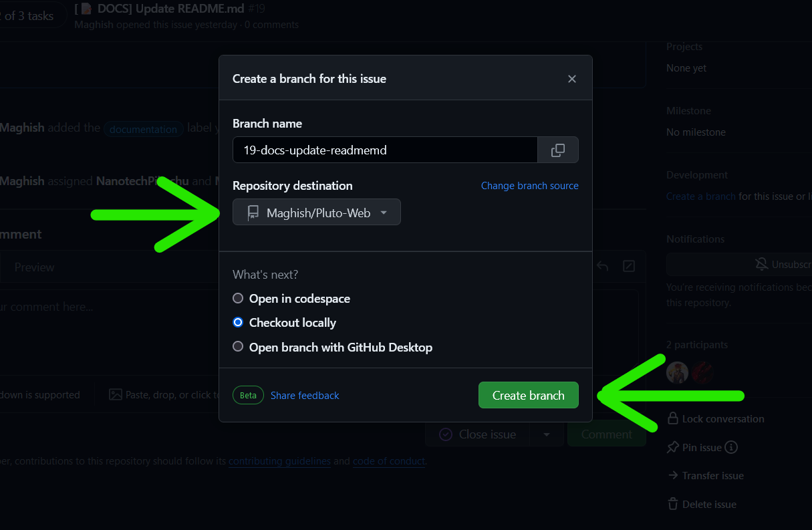

# Contributing to this project

Welcome to Pluto! We appreciate and welcome contributions to our project, your contribution enhances the efficiency of our app.

# Table of Contents

- [Contributing to this project](#contributing-to-this-project)
- [Table of Contents](#table-of-contents)
- [Setup the project locally](#setup-the-project-locally)
- [Guide to contributing to this project](#guide-to-contributing-to-this-project)
- [Code of Conduct](#code-of-conduct)

# Setup the project locally

1. Fork this repository into your Github account.
2. Clone the forked repository to your local system using `git clone https://github.com/USERNAME/Pluto-Web.git` where `USERNAME` is your actual github username.
3. Navigate to `/server` directory which is the back-end of our web application, then run `npm install` (or) `yarn install` to install all dependencies.
4. Create a file named `.env` in the `/server` directory itself, and paste the following into the file:

```
PORT=(The port number you want the backend to run in)
MONGO_URI=(The uri of the MongoDB database)
```

6. Replace the `PORT` environment variable with the port number you want the backend to run in, it is recommended to use the port number `4000` as it is the common port number used for back-end servers. For the `MONGO_URI` environment variable, you need to create an account on [MongoDB Website](https://www.mongodb.com/) and create a project, create a shared database _(the only free-tier database that MongoDB offers per project)_ and click connect button, click drivers and then choose the latest Node.js version and then copy the uri and paste it into the `MONGO_URI` environment variable.
7. At last, you can run `npm run dev` to run the back-end server in nodemon.
> [!IMPORTANT]
> If you intend to run the back-end server in Node.js then you need to run `npm run start` but before that back-end server needs to be complied to JavaScript as it's TypeScript, so run `npm run build` and then proceed with `npm run start` to run in Node.js 
8. Now navigate to `/client` directory which is the front-end of our web application, then run `npm install` (or) `yarn install` to install all dependencies.
9.  Finally, run `npm run dev` to run the front-end client application.

> [!WARNING]
> You need to run two instances in two different terminals, one is the front-end client and another one is the back-end server. If you run only client then the client won't display elements properly as the back-end server is offline.

_Congrats! You have successfully set up the project locally! Now you can start contributing and if you run into any problems, feel free to open a new issue in Bug Report issue template!_ 🥳

# Guide to contributing to this project

1. You can always find issues tagged "good first issue", those issues can be suitable for the new contributors.

2. After finding an issue to work on, first off check if there is any assignees already.

3. Then read the description of the issue and almost every comment on the issue which could be helpful to work on.

4. If there are any assignees already ping/CC them in the issue comments to ask and discuss about their current progress and knowledge on the issue which will be extremely helpful for your work.

5. Finally if you decided to work on the issue alone, then on that issue page you will find "Development" section on the right side of the issue content .

    

    Click the "Create a branch" option inside it.

    

    Select your forked repository to create the branch on, and then click the "Create branch" button.

    

    Once the branch is created, this popup will show up meaning that the branch has been successfully created in your forked repository. Copy the commands in the popup menu and run them in your local clone of your forked repository. From now on you can commit and push that branch after you implemented the issue.

6. After pushing the changes to your forked repository, create a pull request from your forked repository's issue specific branch that you created in the last step to the main repository's main branch and be sure to also mention the issue using `#` (i.e. `#15`) in the pull request's name itself.
7. Your pull request will automatically be reviewed and merged into the main repository _(if it didn't run into any problems or any poor implementation)_.

> [!NOTE]
> If you ran into any bugs and you think you can't fix them, you can simply create an issue using Bug Report issue template on this repository and explain the bug you encountered in that issue, This will help others to identify and bug fix the issue easily. 
 
_Thank you for your contributions to this project, we appreciate it very much!_ 🥳

# Code of Conduct

We appreciate if all the contributions follow the [CODE_OF_CONDUCT](./CODE_OF_CONDUCT.md) to help us build a better community!

> [!NOTE]
> If you like this repository and our work, then why not star our repository to show support?

Once again we thank everyone who has contributed to this project so far and we also appreciate the ones who will contribute to this project in the future!
